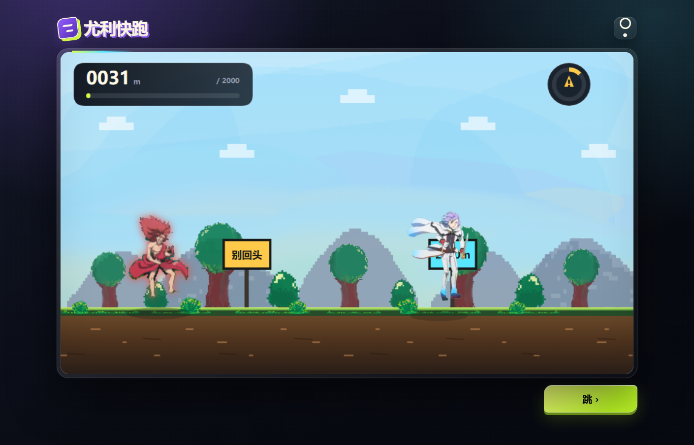

# 尤利快跑

一款无需构建、打开即可运行的浏览器跑酷小游戏。



## 运行

需要 Node.js 18 或更高版本：

```bash
npm start
```

然后访问：

```text
http://127.0.0.1:4174/
```

也可以直接运行：

```bash
node server.js
```

## 操作

- 点击画面或底部按钮：开始、跳跃、重新开始
- 键盘：`Space`、`↑` 或 `W`
- QTE：连续点击中央圆形区域
- 右上角按钮：开启或关闭声音

## 发布到 GitHub Pages

本项目不需要构建：

1. 将仓库推送到 GitHub。
2. 打开仓库的 **Settings → Pages**。
3. 在 **Build and deployment** 中选择 **Deploy from a branch**。
4. 选择主分支和根目录 `/ (root)`。

入口文件为 `index.html`。

## 目录

```text
assets/       音频、角色帧和手动播放的动画帧
images/       天空、山、树木、灌木与草地素材
素材/          原始角色、GIF、视频和结算图片
index.html    页面与 UI
game.js       游戏逻辑与 Canvas 绘制
server.js     本地静态服务器
```

